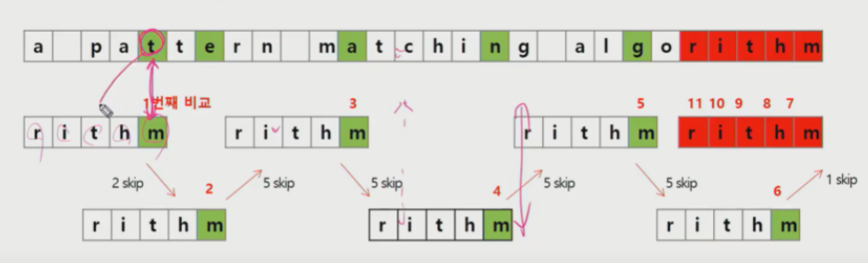
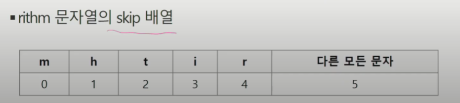

# 고지식한 매칭

<br>

```python
text = 'ABABCA'

for i in range(len(text)-len(target)):
    for j in range(len(target)):
        if text[i+j] == target[j]:
            j+=1
        else:
            break

    print('Identified')
    break
```


<br><br>

# KMP 알고리즘.(시작위치 후보를 잡아놓자)

* 불일치가 발생한 텍스트 스트링의 앞 부분에 어떤 문자가 있는지를 미리 알고 있으므로, 불일치가 발생한 앞 부분에 대하여 다시 비교하지 않고 매칭을 수행.

* 패턴을 전처리하여 배열 next[M]을 구해서 잘못된 시작을 최소화함.

* next[M]: 불일치가 발생했을 경우 이동할 다음 위치
* 패턴내에서 반복하는 구간이 있을것이라는 전제.. 하지만 없다면 무의미. 하지만 패턴이 길다는 전데.

<br>

* 시간복잡도O(M+N)

<br>

### 코드1 : 패턴 배열 next만들기.

```python
# 패턴과 s배열과의 비교가 아니라 패턴내에서의 비교.cnt는 패턴 내에서 일치하는 인덱스.
# 즉 패턴이 일치하면 일치하는 문자의 인덱스를 그 패턴 칸에 기록
# 
cnt = 0 # 일치한 개수
next = [0] * M # 패턴 내에서 일치하는 문자의 인덱스를 기록할 배열
i = 1
while i < M:
    if P[i] == P[cnt]: # 패턴 내에서 투포인터로 일치하는 문자의 인덱스를 비교
    	cnt += 1
        next[i] = cnt
        i += 1
    else:
        if cnt != 0: # 일치 일어나다가 불일치 일어난 상황
			cnt = next[cnt-1] # 불일치 일어난 바로 앞 인덱스가 가진 인덱스값(cnt는 인덱스값인데 next[cnt]에 저장된 것도 인덱스값이기 때문. 거기 저장된 인덱스부터 다시 비교.)
        else: # 그냥 불일치 일어나다 불일치
        	next[i] = 0
        	i += 1
```

<br>

### 코드2 : KMP 순회 만들기.

```python
def KMPSearch(pat, txt):
    M = len(pat)
    N = len(txt)

    lps = [0]*M

    # Preprocess the pattern
    computeLPS(pat, lps)

    i = 0  # index for txt[]
    j = 0  # index for pat[]
    while i < N:
        # 문자열이 같은 경우 양쪽 인덱스를 모두 증가시킴
        if pat[j] == txt[i]:
            i += 1
            j += 1
        # Pattern을 찾지 못한 경우
        elif pat[j] != txt[i]:
            # j!=0인 경우는 짧은 lps에 대해 재검사
            if j != 0:
                j = lps[j-1]
            # j==0이면 일치하는 부분이 없으므로 인덱스 증가
            else:
                i += 1

        # Pattern을 찾은 경우
        if j == M:
            print("Found pattern at index " + str(i-j))
            # 이전 인덱스의 lps값을 참조하여 계속 검색
            j = lps[j-1]

def computeLPS(pat, lps):
    leng = 0  # length of the previous longest prefix suffix

    # 항상 lps[0]==0이므로 while문은 i==1부터 시작한다.
    i = 1
    while i < len(pat):
        # 이전 인덱스에서 같았다면 다음 인덱스만 비교하면 된다.
        if pat[i] == pat[leng]:
            leng += 1
            lps[i] = leng
            i += 1
        else:
            # 일치하지 않는 경우
            if leng != 0:
                # 이전 인덱스에서는 같았으므로 leng을 줄여서 다시 검사
                leng = lps[leng-1]
                # 다시 검사해야 하므로 i는 증가하지 않음
            else:
                # 이전 인덱스에서도 같지 않았다면 lps[i]는 0 이고 i는 1 증가
                lps[i] = 0
                i += 1

# 조금 더 긴 텍스트
# txt = "ABABDABACDABABCABAB"
# pat = "ABABCABAB"
# 본문에서 다룬 예제
txt = 'ABXABABXAB'
pat = 'ABXAB'
KMPSearch(pat, txt)

# This code is contributed by Bhavya Jain
```

```python
def getPartialMatch(N):
    m = len(N) # 패턴의 길이
    pi = [0] * m # 패턴의 길이만큼의 배열(시작후보를 저장할)
    begin = 1 # 1부터 시작(0번부터 매칭 시작할 것이기 때문에 pointer 1)
    matched = 0 # 매치시킬 시작위치(시작후보) pointer 2
    while begin + matched < m: # 시작위치 + counter가 패턴의 종료위치까지 가면 종료
        if N[begin  + matched] == N[matched]: # 일치하면 매칭시킬 index pointer증가
            matched += 1
            pi[begin + matched - 1] = matched # 시작 인덱스배열에 매칭된 문자의 인덱스
        else: # 일치되지 않으면
            if matched == 0: # 전에도 일치된게 없으면 그냥 다음꺼 가서 조사
                begin += 1
            else:	# 그전에 일치한 문자가 있었다면 어디까지 되돌아 갈꺼냐?
                begin += matched - pi[matched - 1] # 매칭후보군인덱스에
                matched = pi[matched - 1] # 매칭시킬 시작 위치를 마지막에 일치한 문자 위치에 입력된 시작 index(그니까 ababab라면 3번째 b에 입력된 숫자는 3일테고 그 b에 입력된 숫자는 1일 것이다.)
    return pi


```


아래 다 동일 알고리즘. 그냥 여러 코드 보고 구조파악하기 위해 남김. 

```python
def kmpSearch(H, N):
    n = len(H)
    m = len(N)
    # 결과값 리스트
    ret = []
    # pi[i]는 N[~i]의 접두사도 되고 접미사도 되는 문자열의 최대 길이.
    pi = getPartialMatch(N)
    
    begin = 0
    matched = 0
    while begin <= n - m:
        # 글자가 일치한다면?
        if matched < m and H[begin + matched] == N[matched]:
            matched += 1
            # m글자가 모두 일치한다면?
            if matched == m:
                ret.append(begin)
        else:
            # matched가 0인 경우 다음 칸에서 시작
            if matched == 0:
                begin += 1
            else:
                begin += matched - pi[matched - 1]
                matched = pi[matched - 1]
    return ret
```

<br>

```python
def KMP(s, p):
    global table
    
    j = 0
    for i in range(len(s)):
        while j > 0 and s[i] != p[j]:
            j = table[j-1]
        if s[i] == p[j]:
            if j == len(p)-1:
                return True
                j = table[j]
            else:
                j += 1
    return False
  
def make_table(p):
    global table
    
    j = 0
    for i in range(1, len(p)):
        while j > 0 and p[i] != p[j]:
            j = table[j-1]
            
        if p[i] == p[j]:
            j += 1
            table[i] = j
```


<br><br>

# 보이어 무어 알고리즘

<br>

* 패턴의 오른쪽 부터 비교해서 불일치가 일어난 문자가 내 패턴내에 없으면 패턴의 길이만큼 점프한다.
* 패턴 내에 있으면 그 위치를 패턴내 위치와 일치시키고 또 마지막 문자를 비교한다.
* 

들어있는 애라면 몇칸의 index를 건너뛰어야 일치되는지를 미리 기록해둠.

다른 모든 문자(포함되지 않은 문자면 배열의 길이만큼 스킵.)

<br>

* 문자가 중복, 여러번 나오면 어떻게 할꺼냐? -> skip배열을 잘짜야함.



<br><br>

```python
#문자열 검색하는 보이어 무어 알고리즘
def boyer_moore(pattern, text):
    #길이를 자주쓰므로 길이를 받아둔다.
    M = len(pattern)
    N = len(text)
    i = 0
    #반복은 최대 긴텍스트 길이 - 작은텍스트 길이
    while i <= N-M:
        #보이어 무어 알고리즘은 뒤에서부터 접근하므로 pattern길이의 -1을 해준다.
        #-1을 해주는 이유는 인덱스가 0부터 시작하기 때문이다.
        j = M - 1
        #뒤에서부터 검사하고 인덱스를 감소하는 형식이므로 0보다 이상일때만 동작한다.
        while j >= 0:
            #끝글자부터 비교하면서 같다면 하나씩 감소하면서 비교한다.
            if pattern[j] != text[i+j]:
                #글자가 틀리다면 제일마지막 글자 기준으로 find 함수를 호출한다.
               move = find(pattern, text[i + M - 1])
                break
            j = j - 1
        #인덱스가 -1이라는 뜻은 모든 글자가 맞았다는 이야기이다.
        if j == -1:
            #찾았으므로 true를 리턴한다.
            return True
            #인덱스 위치를 찾는다면
            #return i
        else:
            #-1이 아니라면 글자를 못찾은 것이므로 find에서 넘겨준 값만큼 옆으로 이동한다.
            i += move
    #여기까지 왔다면 끝까지 찾지 못한것이므로 False를 리턴한다.
    return False
    #인데스 위치로 한다면
    #return -1
 
#불필요한 비교를 건너뛰기 위한 함수
def find(pattern, char):
    #마지막 부분과 일치하는 부분이 있는지 검색한다.
    #마지막 부분은 이미 가능성이 없으므로 그전부터 검사한다.
    for i in range(len(pattern)-2, -1, -1):
        #마지막글자와 패턴중 일치하는 숫자가 있다면 그만큼 이동한다.
        if pattern[i] == char:
            return len(pattern) -i -1
    #일치하는 글자가 없다면 패턴의 길이만큼 이동한다.
    return len(pattern)
```

<br>

```python
# skip 배열 만들기
def initSkip(p):
    NUM = 27  # 알파벳 수
    M = len(p) # 패턴의 길이
    skip = [M for i in range(NUM)] #skip 함수를 모두 M값으로 초기화
    for i in range(M):
        skip[ord(p[i]) - ord('A')] = M - i - 1 
    return skip # skip 배열 반환

print(initSkip("ATION")) # 임시로 ATION 이란 패턴을 입력

#보이어 무어 알고리즘
def BM(p, t):
    M = len(p)
    N = len(t)
    skip = initSkip(p)

    i = M-1
    j = M-1

    while j >= 0:
        while t[i] != p[j]:
            k = skip[ord(t[i]) - ord('A')]
            if M - j > k:
                i = i + M - j
            else:
                i = i + k
            if i >= N:
                return N
            j = M - 1
        i = i-1
        j = j-1
    return i+1

print(BM("ATION","VISOINQUESTIONONIONCAPTIONGRADUATION"))
```

<br><br>


# 라빈 카프(Rabin - karp)

긴문자열과 부분문자열의 '해시값'의 비교를 통해서 매칭시킵니다.


해시값은 2의 n승과 아스키코드의 연산을 통해 구한다.

긴 문자열에서 부분문자열과 같은 길이의 문자열의 해시값들을 찾아 부분문자열과 비교. O(N)

한 칸 이동한 결과는 어떻게 빠르게 구할 수 있을까?

<br>

> 바로 앞에있는 문자 만큼 수치를 빼준 후 2를 곱하고 뒤에 들어오 ㄴ수치를 더해준다.
>
> 새로운 해시갑 : 2*(기존 해시값 - 가장 앞에 있는 문자의 수치) + 새롭게 들어온 문자의 수치
>
> => 슬라이딩 윈도우(Prefix Sum 기법)

<br>


```python
def findString(parent, patttern):
    parentSize = len(parent)
    patternSize = len(pattern)
    
    parentHash, patternHash = 0, 0
    power = 1 # 최소 2의 0승부터 시작
    
    for i in range(parentSize - patternSize):
        # 제일 처음 초기화
        if i == 0:
            for j in range(patternSize):
                parentHash += parent[patternSize - 1 - j] * power
                patternHash += pattern[patternSize - 1 - j] * power
                # 패턴 문자열의 사이즈보다 j가 작다면 2씩 곱해주라는 뜻.
                if j < patternSize - 1:
                    power *= 2
        else:
            # 다음 긴 글의 해시값.
            parentHash = 2 * (parentHash - patent[i-1] * power) + patent[patternSize - 1 + i]
        if parentHash == patternHash:
            finded = True
            for j in range(patternSize):
                if parent[i+j] != pattern[j]:
                    finded = False
            		break
            if finded:
            	# i+1번째에서 패턴 발견    
                return i+1

parent = 'sadkjfljsdjfsd'
pattern = 'fjsdkljf'

findString(parent, pattern)
            
```


## 어디서 가져온 라빈카프 클래스

```python
class rolling_hash:
    # 초기화. 해시값도 gethash이용해서 구해줌
    def __init__(self, text, patternSize):
        self.text = text
        self.patternSize = patternSize
        self.base = 26
        self.window_start = 0
        self.window_end = 0
        self.mod = 5807
        self.hash = self.get_hash(text, patternSize)
	# 패턴의 모든 문자에 대해 아스키코드 번호값에 26의 맨뒷자리는 0승 맨앞자리는 (패턴사이즈-1)승 해서 5807나머지값 부여
    def get_hash(self, text, patternSize):
        hash_value = 0
        for i in range(0, patternSize):
            hash_value += (ord(self.text[i]) - 96)*(self.base**(patternSize - i -1)) % self.mod

        self.window_start = 0
        self.window_end =  patternSize
	# 다음 윈도우로 넘어감(맨앞 글자만큼 해쉬값빼주고 맨뒤꺼 더해줌. 시작,끝 인덱스 하나씩 증가)
        return hash_value
    def next_window(self):
        if self.window_end <= len(self.text) - 1:
            self.hash -= (ord(self.text[self.window_start]) - 96)*self.base**(self.patternSize-1)
            self.hash *= self.base
            self.hash += ord(self.text[self.window_end])- 96
            self.hash %= self.mod
            self.window_start += 1
            self.window_end += 1
            return True
        return False
    def current_window_text(self):
        return self.text[self.window_start:self.window_end]
# 체킹하는 함수
def checker(text, pattern):
    if text == "" or pattern == "":
        return None
    if len(pattern) > len(pattern):
        return None
	# 해시값 구하는 객체 생성
    text_rolling = rolling_hash(text, len(pattern))
    pattern_rolling = rolling_hash(pattern, len(pattern))

	# 해시값이 동일한게 발견되면 찾음
    for _ in range(len(text) -  len(pattern) - 1):
        if text_rolling.hash == pattern_rolling.hash:
            return "Found"
        # 못찾으면 다음 윈도우로 넘어감.
        text_rolling.next_window()
    return "Not Found"


if __name__ == "__main__": 
    print(checker("abcdefgh", "a"))
```

<br><br>

## 비교

* 찾고자하는 문자열 패턴의 길이 m, 총 문자열 길이 n
* 고지식한 패턴 O(mn)
* 카프 - 라빈 수행시간 O(n)
* KMP O(n)
* 보이어무어 O(n) 최악 O(mn) 다른 알고리즘들은 문잘르 적어도 한번씩 훑지만 보이어무어는 다 안봐도 됨.

<br>

## 문자열 압축.

* BMP파일포맷 압축 방법.(Run-length encoding 알고리즘)
* 허프만 코딩 알고리즘.

