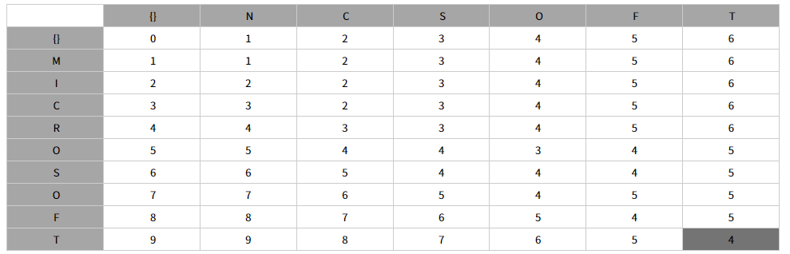

# 편집거리 알고리즘

* 두 문자열의 유사도를 판단하는 알고리즘

* 유사도란? 어떤 문자열을 삽입, 삭제, 변경을 몇 번 해서 동일하게 바꿀 수 있는지의 최솟값.
* LCS와 같이 2차원 배열을 통해 문자열을 하나씩 비교.
* 최초는 공집합과 비교해 문자열 길이만큼 1씩 카운트를 준다(공집합에서 그 문자열이 되려면 열마나 삽입되어야 하는가?)

* 두 문자를 비교해 추가, 삭제, 변경의 소요마다 1씩 카운트.
* A[i]==B[j]일 때 편집거리 D(i,j) = D(i-1,j-1) 같은 문자가 나왔을 때는 대각선 왼쪽 위의 값을 가져온다.
* A[i]!=B[j] 면 D(i,j) = min(D(i-1,j),D(i,j-1),D(i-1,j-1)) + 1 즉 수정, 삽입, 삭제를 한 편집거리중 최소값을 가져온다.



```python
def editDistance(str1, str2, m, n):
 
    # If first string is empty, the only option is to
    # insert all characters of second string into first
    if m == 0:
        return n
 
    # If second string is empty, the only option is to
    # remove all characters of first string
    if n == 0:
        return m
 
    # If last characters of two strings are same, nothing
    # much to do. Ignore last characters and get count for
    # remaining strings.
    if str1[m-1] == str2[n-1]:
        return editDistance(str1, str2, m-1, n-1)
 
    # If last characters are not same, consider all three
    # operations on last character of first string, recursively
    # compute minimum cost for all three operations and take
    # minimum of three values.
    return 1 + min(editDistance(str1, str2, m, n-1),    # Insert str2[n]을 삭제하여 전과 동일한 연산
                   editDistance(str1, str2, m-1, n),    # Remove str1[m]을 추가하여 전과 동일한 연산
                   editDistance(str1, str2, m-1, n-1)   # Replace str2[n]을 str1[m]으로 변경
                   )
 
 
# Driver code
str1 = "sunday"
str2 = "saturday"
print editDistance(str1, str2, len(str1), len(str2))
```

