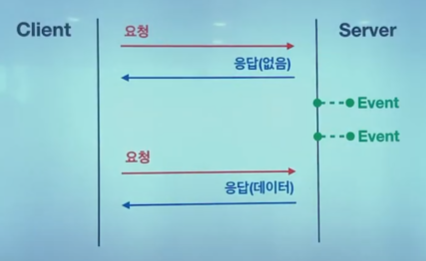
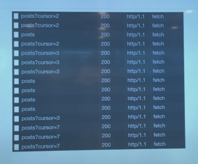
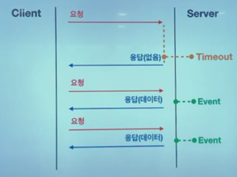
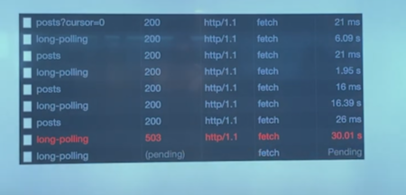
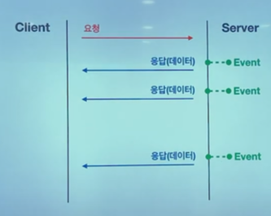
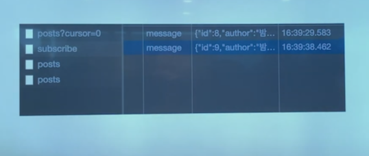
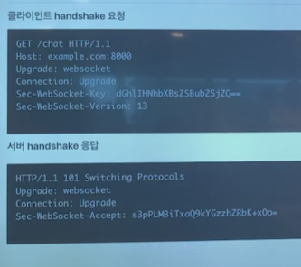
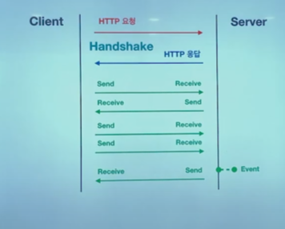

# Realtime Web이란?

> 인터넷에서 사용자들로 하여금 창작자가 정보를 만들어내는 즉시 수신할 수 있도록하는 기술 혹은 서비스

 

**정통적인 웹**

* 웹은 HTTP 요청-응답 모델을 기반으로 구축된다.
* HTTP는 무상태 프로토콜이며 클라이언트와 서버 간의 통신은 각각 독립적인 요청과 응답의 쌍으로 구성된다.
* 웹 브라우저에서 폼을 채우고 이를 웹 서버로 제출하는 하나의 요청으로 웹 서버는 요청된 내용에 따라서 데이터를 가공하여 새로운 웹 페이지를 작성하고 응답으로 되돌려준다.(=포스트백 : 요청이 있을 때마다 페이지를 새로 그리는 것.)

 

**AJAX 등장** 

* 사용자 인터페이스 나머지 부분을 방해하지 않고 비동기로 데이터를 송/수신 할 수 있다.
* 전체 페이지를 다시 로딩하는 것이 아닌 일부분만 변경하기 때문에 빠른 화면 전환이 가능하다.

 

> 즉시 수신 할 수 있는 기술들에 대한 사용자 수요 증가.(리얼 타임 웹)

 

 

## Polling(폴링)

* 전송할 데이터의 유무에 관계없이 주기적으로 요청을 수행하는 방법.

* 클라이언트는 지정된 시간 간격에 맞춰 서버에 지속적인 요청을 보낸다.

* 서버는 각 요청마다 가용 데이터나 데이터가 없는 경우 빈 데이터를 보내거나 실패와 같은 적절한 응답을 한다.

  

 

> 일정 시간마다 서버에 요청을 보내는데 그 사이에 서버에서 일어나는 이벤트들에 대해 바로 대응이 불가.

 

post여러번 받았지만 결과는 일정 주기로 갖고옴.

### 특징

* 데이터 유무와 관계없이 요청하여 불필요한 네트워크 비용이 발생한다.
* 클라이언트와 서버 자원을 많이 낭비한다.
* 요청의 간격이 길면 실시간성이 떨어진다.
* 반대로 간격이 짦으면 많은 자원을 소비한다.
* 서버 이벤트가 일정한 주기로 발생하면 효율적이다.

 

 

## Long polling(롱 폴링)

* 서버 이벤트가 발생할 때까지 응답을 미루는 방법이다.
* 폴링과 다르게 클라이언트의 요청에 대해 서버가 전송할 데이터가 있거나 타임아웃될 때까지 연결을 끊지 않고 지속한다.
* 서버로 부터 응답을 받는 그 즉시 롱 폴링 요청을 다시 수행한다.

> 서버가서 이벤트 발생때까지 대기타는 방법.

타임아웃되면 503 리턴

**롱폴링 특징**

* 폴링과 다르게 불필요한 네트워크 비용이 덜 발생한다.
* 서버 이벤트가 발생하는 즉시 응답을 하기 때문에 실시간성이 높다
* 반대로 서버 이벤트가 빈번하게 발생하면 폴링보다 더 많은 요청을 수행한다.

## Server-sent events(SSE)

* HTTP를 사용하여 서버 푸시를 구현하는 방법
* HTTP 스트리밍 방식. SSE사양에 따라 구현
* 클라이언트가 request하면 서버는 무기한 연결을 유지하고 준비가 되면 data를 보냄
* 서버 이벤트가 발생하면 응답을 완료하여 연결을 끊는게 아니라 응답 스트림에 청크 단위 데이터를 계속 보낸다.

이벤트소스라는 걸 사용해 구축. 홈 메세지로 청크데이터를 일정 데이터로 받음.

웹 Flux 이용함. produce에 Medua Type 이벤트 스프림을 무조건 해줘야함.

이거 안하면 이벤트소스 지원하지 않는경우 스트림으로 읽을 수가 없다.

구독한 데이터가 청크단위로 계속 쌓임.

 

**특징**

* HTTP 사용하기 때문에 기존 개발 방식과 다르지않음
* HTTP 헤더로 인한 오버헤드가 거의 없다.(헤더 요청한번씩에 그냥 청크단위로 보내기 때문)
* 연결이 유지되기 때문에 실시간성이 매우 높다
* 연결이 끊긴 경우 재접속 처리를 자동으로 해준다.
* 서버에서 클라이언트로 단방향 통신만 가능하다.

 

## Websocket(웹소켓)

* HTTP가 아닌 웹 소켓을 사용하여 실시간 양방향 통신을 지원하는 방법이다.
* HTTP를 통해 웹소켓 프로토콜로 전환하는 handshake 과정이 필요하다.
* 이후 웹소켓을 통해 통신이 이루어진다.

**특징**

* HTTP를 사용하지 않아 전체 메시지 크기가 줄어든다.
* 클라이언트와 서버의 자원을 최소화 할 수 있다.
* 양방향으로 빠른 요청과 응답이 가능하다.

 

---

 

## 기술 선택

* Polling
  * 서버 개발을 할 수 없는 상황이다.
  * 외부 API가 서버 푸시를 지원하지 않는다.
* Long-Polling : 안 씀.
* Server-sent events
  * 새로운 데이터에 즉시 수신만 해도 되는 경우.
  * 알림, 실시간 댓글등을 구현해야 한다.(JS로 폴리필 구현가능.)
* Websocket
  * 네트워크 지연을 최소화해야 한다.
  * 채팅, 게임과 같이 사용자 간 빠른 피드백이 이루어져야 한다.

