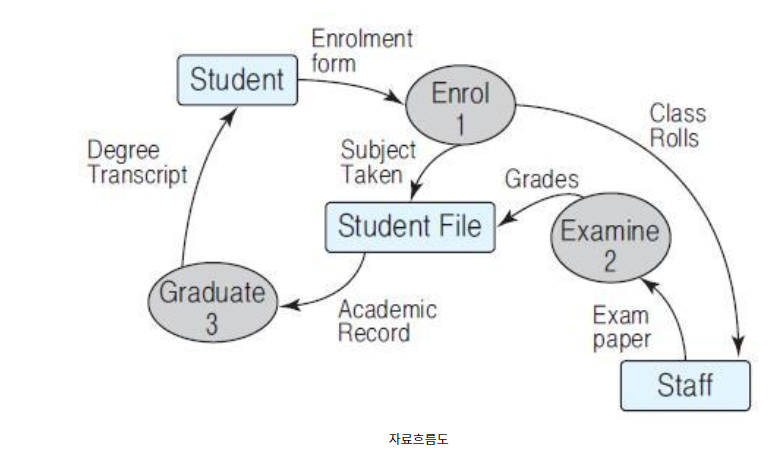
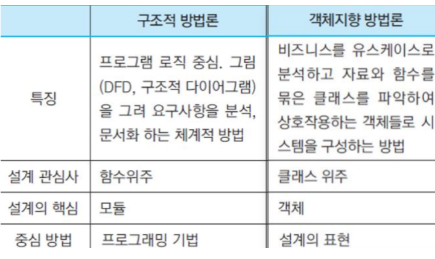

## 방법론

* 어떻게 접근할 것인가?

* 소프트웨어 프로세스의 각 작업을 `어떻게`수행하느냐?
* 프로세스는 각 단계의 입력자료와 결과물은 제시하지만 그 내용의 `표현방법`에는 규정되어 있지 않다.
* 바로 방법론이 표현의 차이를 만드는 것이다.

### 1. 구조적 방법론

* 복잡한 문제를 다루기 위해 분할정복 원리를 적용한다.

  * 최초 시스템 전체를 하나의 프로세스로 보고 최상위 레벨의 자료흐름도(DFD)를 그린다.
  * 그 다음 단순한 프로세스가 될 때까지 나눈다음 그것을 차례로 구현하면서 다시 올라온다.
  * 말단 프로세스의 입렵, 출력, 자료구조, 알고리즘을 명시한다.

* DFD는 현재 업무 프로세스뿐 아니라 새로 제안된 프로세스까지 나타낼 수 있지만 모듈 사이의 구동관계를 나타내기는 한계가 있다. 때문에 구조적 설계를 한다.

* 구조적 설계는 자료 흐름도를 구조도로 변경하는 과정이다. 구조도는 모듈 사이의 관계를 나타내는 그래프로 노드는 모듈이고 간선은 상위층의 모듈이 서브루틴을 함수호출한다는 의미이다.

  

### 2. 객체지향 방법론

* 객체 사이의 interation을 모델링하는 방법론.
* 자료와 함수를 같이 정의하여 객체로 묶어두고 호출해서 원하는 기능을 담당하게 되는 것이다.
* 함수를 시스템 전체에 흩어지게 하는 것보다 한곳(classes)에 모아두는 것이 시스템을 단순하게 한다.
* 복잡한 대규모 시스템을 클래스로 모듈화하고 캡슐화 하는 것을 객체지향 방법론이 가능하게 한다.
* 주어진 작업을 수행하기 위해 객체들을 모아놓은 것의 시스템화.

### 3. 애자일 방법론

> 전통적 방식
* 전통적인 개발 방법론은 철저한 요구사항 수집 및 분석, 이를 바탕으로 한 세밀한 설계, 설계에 딱 맞는 구현, 설계-구현에서의 부족한 점을 테스트를 통해 보완하는 구조로 되어 있지만 현대의 소프트웨어 분야의 트렌드와는 잘 맞지 않는다. 
* 현대에는 개발 시작 시점에 요구사항이 완벽한 경우가 별로 없다. 
* 시장의 요구 변화에 맞춰 개발 진행 중에 상당 부분 변경
* 이러한 요구사항 변화를 기존 프로세스 상에 반영하는 것은 거의 불가능

> 에자일 방식
* 전통적인 소프트웨어 개발 방법론의 단점을 보완하기 위해 생겨난 개발 방법론
* Agile은 현대 소프트웨어 개발 과정의 특성을 반영하고자 하는 프로세스
* 시장은 항상 변하고, 이에 따라 요구사항은 항상 변한다. 시간이 지날수록 사용자의 요구사항은 더 많아지게 된다. 
* 요구사항들을 중요도, 개발 기간, 구체화 정도 등의 요소를 통해 순위를 매기고 이들 중 일부를 가지고 개발에 착수
* 전체 요구사항을 모두 수집하는 방식에 비해 요구사항 분석이 짧다. 
* 요구사항의 개수가 적으므로 각 단계별 수행 시간이 짧다.
* 프로세스의 기간 단축
* 1차 개발을 완료한 후 남아 있거나 새로 추가된 요구사항, 수정된 요구사항들을 모아 다시 같은 과정을 반복한다. 
* 이 과정에서 소프트웨어 결과물은 항상 동작 가능한 상태를 유지한다.

> Agile은 구현에서 테스트로 넘어가는 기간을 단축시켜 디버깅이 용이하게 해준다. 짧고 반복적인 개발을 통해서 전체 프로세스의 종료 시간을 예측하는데 도움을 준다. 새로운 요구사항이 나올 경우 다음번 주기에 바로 반영시킬 수 있으므로 고객 피드백이 빨라진다.