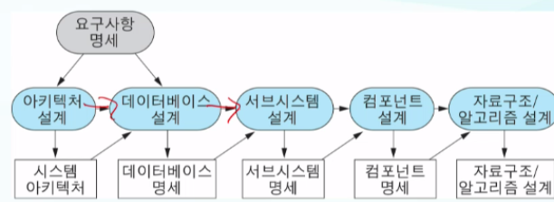
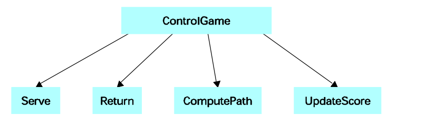
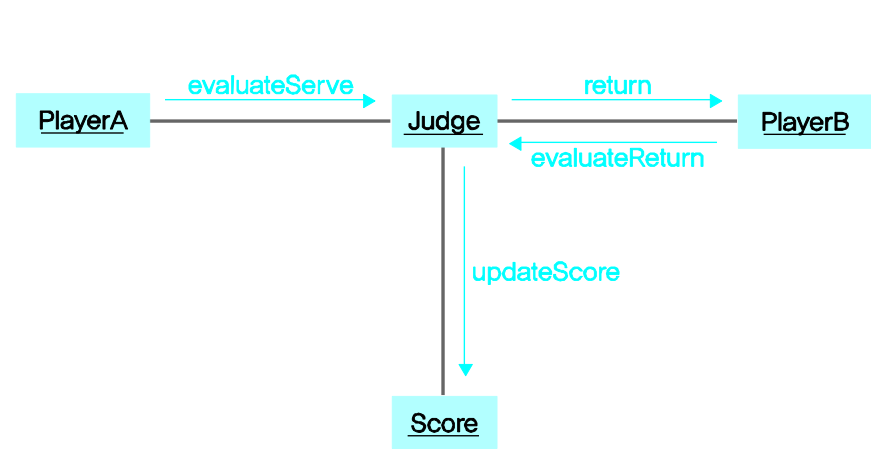

## 소프트웨어를 개발하는 절차

> 개발 프로세스의 목표는 `생산성`

1. ### 요구분석과 정의

   

   * 소프트 웨어 시스템이 풀어야 할 문제를 이해하기 위해서 하는 일
   * 시스템이 `어떻게`작동하냐 보다 우리가 시스템에게 `무엇이` 필요한가를 생각해 보아야함
   * 소프트웨어 요구 명세서로 요구를 문서화 할 필요가 있다.
     * 문제분석 : 문제와 그 배경을 이해하고 개발할 시스템 요구를 탐색
     * 요구정리 : 요구를 문서로 정리(요구 명세서) 
       * 시스템 기능 이외 설계에 영향을 주는 모든 요인을 보여줘야함.(사용자 매뉴얼 등)

    

   * 요구사항 분석 정의
     * 시스템 목표를 확립하는 과정을 **요구사항 분석과정**이라 하며 요구사항 분석은 행동을 취하기 전 문제에 대하여 연구하는 것을 말한다.
     * 요구사항 분석은 시스템이 만족시켜야 할 요구사항의 발견, 정제, 모델링, 그리고 명세화하는 과정
     * 요구사항 분석은 새롭게 만들고자 하는 시스템의 명세를 만들어내는 과정으로 시스템이 만족시켜야 할 기능, 성능, 그리고 다른 시스템과의 인터페이스 등을 규명한다.
     * 요구사항 분석의 최종 산출물은 사용자의 요구사항 명세서 (Requirements Specification)로, 기능 명세서(Function Specification) 또는 목표 문서(Target Document)라고도 부른다.

    

   * 분석의 특징
     * 소프트웨어 시스템의 요구사항 분석은 설계, 코딩 및 시험과는 다른 특징을 많이 가지고 있으며, “어떻게(how to)” 가 아니라 “무엇(what)”에 초점이 맞춰져 있다.
     * 요구사항 분석은 개발과는 다르게 고객들과 협상하여 공동의 목표를 끌어내야 한다.
     * 요구사항 분석은 성공을 목표로 한다기 보다는 실패나 실수를 방지하고 프로젝트 초기 단계의 중대한 실수를 최소화하는 데 그 목적이 있다.

    

   * 시스템 분석과 소프트웨어 개발 환경의 변화
     * 1960년대에 시작된 소프트웨어 시스템 개발은 다양한 분야를 자동화 시키며 빠른 속도로 확장되어 왔다. 초창기 사용자들은 자동화 되는 것을 신기함과 호기심을 가지고 수용하였으므로 불만이 거의 없었다.
     * 지금은 단순한 응용분야는 물론 복잡한 응용분야의 전산화가 이루어 지고 있다.
     * 과거에는 전산학 전공자들이 응용분야로 진출해 자동화시키는데 별 문제가 없었으나, 현재는 전산업무의 복잡화로 전산학 전공자들이 더욱 복잡해진 응용분야의 전산화에 어려움을 겪고 있고, 응용분야를 전공한 사람들이 전산 지식을 습득하여 전산 업무에 뛰어들고 있는 실정이므로 전산학과 출신들의 앞날에 위협을 받고 있다.

    

   * **시스템 분석가의 자질과 임무**

     * 분석가의 임무를 수행하기 위한 자질

       ① 비즈니스나 응용분야에 대한 지식이 필수적이다.

       ② 하드웨어, 소프트웨어를 포함한 컴퓨터에 대한 기술을 이해하고 있어야 한다.

       ③ 의사소통(Communication)능력

       ④ 사용자들로부터의 모순되는 요구사항을 해결해야 한다.

       ⑤ 시스템을 만들어야 하므로 상대의 관점(고객의 관점)에서 문제를 볼 수 있는 눈이 필요

     * 분석가의 임무

       ① 사용자는 익숙하지 않은 컴퓨터 전문용어를 불편해 하므로 분석의 결과를 쉬운 용어로 설명해야 함.

       ② 시스템 개발의 최전방에 앞장서 나가야 하는 역할 이므로 주도적으로 일을 처리해야 함.

       ③ 사용자의 요구사항과 전문지식을 뽑아내는 일을 해야 함.

    

   * 요구사항 명세서

     * 요구사항 분석의 최종 목표는 요구사항 명세서를 만드는 일.

     * 요구사항명세서는 소프트웨어 시스템의 생명이 다할 때까지 따라다니므로 초기에 완벽한 요구사항 명세서를 만드는 것이 프로젝트를 성공적으로 수행하는데 필수적.

     * 요구사항 명세서의 만족 조건

       ①   요구사항 명세서는 고객과 개발자 모두 쉽게 이해할 수 있도록 만들어져야 한다.

       ②   요구사항 명세서에 명시되어 있는 조건들은 고객과 개발자가 동의한 것이어야 한다.

       ③   요구사항 명세서는 제안된 시스템이 수행할 모든 기능을 명확하게 기술해 놓아야 한다. 시스템이 수행할 기능은 요구사항 명세서의 핵심이다.

       ④   제안된 시스템에 영향을 미치는 모든 제약조건을 요구사항 명세서에 명시하여야 한다.

       ⑤   시스템을 사용하기 위해 필요한 조항들을 검증할 수 있도록 요구사항 명세서에 검증기준을 제시하여야 한다.

       ⑥   원하는 시스템의 품질, 상대적인 중요선, 품질의 측정 및 검증 방법 등을 요구사항 명세서에 명시하여야 한다.

       ⑦   시스템의 포용성과 오류 조건의 명시되어야 한다.

    

   

   * 분석의 문제점

     * 분석의 어려움

       ①   의사소통 문제

       ②   요구사항의 계속적인 변화

       ③   분석도구의 미비

       ④   문서화의 어려움

       ⑤   정치적인 문제

       ⑥   일 할당 문제

     * 사용자의 개발자 사이에 동의된 것도 시간이 지나고 나면 완전히 다른 모습으로 나타날 때가 있다. 그러므로 정확한 의사소통과 목표에 대한 기대를 명확하게 하기 위해서 반드시 문서화가 필요하다.

     * 시스템이 크면 클수록 분석과정이 복잡해지며 분석의 복잡도를 해결하기 위해 사용하는 효과적인 방법은 분할하여 정복하는 것이다.

     * 분석은 상당히 정치적인 문제에 속하며 이를 피할 수 없는 경우가 많다. 요구사항 분석시 방법론을 도입하여 접근하면 분석과정을 더운 체계적이고 공식적인 과정으로 만들 수 있고, 정치적인 영향력을 최소화 시킬 수 있다.

    

   * 요구사항 분석 방법의 공통점

     * 분석에 요구되는 기본적인 분석 원칙

       ①   분석 방법들은 시스템의 계층적이며 구조적인 표현을 가능하게 한다.

       ②   분석 방법들은 외부(사용자)와의 인터페이스는 물론, 시스템 내부 구성요소들 사이의 인터페이스에 대한 세심한 주의를 필요로 한다.

       ③   또한 분석 방법들은 분석 이후 단계인 설계와 구현 단계에 필요로 하는 기본 틀을 제공해 준다.

       ④   정형 명세 언어 이외의 다른 분석 방법들은 제약 조건이나 검증 기준의 표현에 많은 관심을 두고 있지 않다.

    

   * 요구사항 수집 및 사용자와의 대화 방법

     * 소프트웨어 개발에 있어서 가장 어렵고도 중요한 문제는 고객의 문제점을 이해하는 일이다. 고객과의 직접적인 대화를 **인터뷰**를 통하여 이루어진다.

     * 인터뷰 개요

       * 인터뷰는 개발될 시스템과 관계된 조직의 직원 및 필요한 분야의 전문가와 직접 대화하여 요구되는 정보를 뽑아내는 방법이다.

       * 인터뷰의 가이드라인

         ①   **누구(WHO):** 누가 분석하는 과정에 참여 할 것인가?? 각 참여자는 어떤 역할을 수행 할 것인가? 누가 시스템을 사용할 것인가? 사용자들은 컴퓨터에 대하여 잘 알고 있는 전문가 인가, 아니면 초보자들인가?

         ②   **무엇(WHAT):** 현재의 상태는 어떠한가? 현재의 문제는 무엇인가? 만들어질 시스템은 어떤 모습이며 어떤 기능이 수행되어야 하는가?

         ③   **언제(WHEN):** 언제 새 시스템이 설치되어야만 하는가? 언제 새 시스템에 대한 합격 검사가 이루어질 것인가?

         ④   **어디(WHERE):** 기존 환경의 어디에 새 시스템이 이용될 것인가? 현재의 인원들은 새 시스템의 어디에 배치 될 것 인가?

         ⑤   **왜(Why):** 왜 새로운 시스템이 개발되어야 하는가? 왜 고객이 새로운 시스템의 개발을 필요로 하는가? 무엇이 기존의 시스템에서 새로운 시스템 개발을 유발시켰는가?

         ⑥   **어떻게(HOW TO):** 새로운 시스템은 어떻게 기능을 수행 할 것인가? 새로운 시스템은 어떤 제약조건 하에서 기능을 수행할 것인가?

       * 인터뷰 계획

         * 인터뷰를 시작하기 전에 분석가는 사전 준비를 해 두어 기본 지식을 가지고 인터뷰를 들어가야 한다.
         * 인터뷰의 목적을 확립해야 한다.
         * 누구를 인터뷰할 것인가를 결정해야 한다.
         * 인터뷰에 응하는 사람이 준비할 수 있도록 사전에 통보해 주어야 한다.
         * 인터뷰하기 이전 질문의 유형과 질문의 구조를 준비해 두어야 한다.

     * 질문 유형

       * 열린 질문

         ①열린 질문 유형은 질문에 대하여 인터뷰에 응하는 사람이 고정되어 잇는 답을 말하는 것이 아니라 최선을 다하여 자신의 의사를 말하는 것

         ②장점

         * 인터뷰에 응하는 사람이 편안히 느끼고 구체적인 많은 정보를 제공해 줄 수 있다는 점.
         * 열린 질문을 통해 새로운 주제에 대한 질문을 찾아낼 수 있다.

         ③단점

         * 주제와 관계없는 사항에 대하여 너무 구체적으로 들어가 시간을 낭비할 수 있다.
         * 인터뷰에 응하는 사람이 자신의 대답에 너무 많은 시간을 들여 분석가가 인터뷰에 대한 제어를 못할 가능성이 있다.

       * 닫힌 질문

         ①닫힌 질문은 열린 질문 대신 사용할 수 있는 질문 유형

          ②장점

         * 구체적인 주제를 가지고 직접적인 질문을 함으로써 시간을 절약할 수 있으며, 그 대답 또한 주제에 맞춰져 있어 빠르게 인터뷰를 진행할 수 있다.
         * 다른 인터뷰 결과와 비교하여 볼 수 있고, 질문을 계속할 수 있어 주도적으로 인터뷰를 해나갈 수 있다.

          ③단점

         * 인터뷰에 응하는 사람의 개인적인 의사를 나타내지 못해 지루해지기 쉽다는 점.
         * 질문에 대한 반응이 고정되어 있고, 열린 질문을 할 때 얻을 수 잇는 추가적인 정보를 얻지 못할 수가 있다.
         * 내용이 건조하여, 분석가와 인터뷰에 응하는 사람 간의 좋은 인간관계를 구축하는 데 큰 도움을 주지 못한다.

       * 추가 질문

         * 추가질문은 답변에 대하여 명확히 알고자 할 때 사용

     * 인터뷰의 구조

       1. 피라미드 구조
          * 질문의 유향이 구체적인 예에서 일반적인 것으로 옮겨가도록 준비하면 질문의 형태가 피라미드 구조를 가진다.

       2. 깔때기 구조
          * 분석가가 일반적이며 열린 질문으로 시작하여 점차 닫힌 질문으로 좁혀 나갈 때 나타난다.

       3. 다이아몬드 구조
          * 앞의 두 구조를 섞은 것이며 구체적인 질문으로 시작하여 일반적인 문제들이 다루어진 후 마지막으로 구체적인 결론들이 유도될 수 있도록 인터뷰가 진행된다.

     * 인터뷰의 주의점

       * 인터뷰가 성공적으로 진행되어 필요한 정보를 얻기 위해 분석가는 **주도적**으로 인터뷰를 진행해야 한다.

     * 설문지

       * 인터뷰가 직접 만나거나 전화통화를 하여 정보를 모으는 한 방법인 반면, 설문지에 의한 방법은 질문사항을 만들어 우편이나 통신망으로 보거나, 설문지를 전달하여 간접적으로 정보를 모으는 방법 

    

   * 모델링(modeling)
     * 모델링이란 연구 또는 개발 대상 시스템의 성능 분석이나 동작과정 등을 알아보기 위하여
     * 간단한 물리적 모형, 도해를 만들거나 또는 그 시스템의 특성을 수학적으로 표현하는 과정.
     * 모델링은 어떤 것을 만들기 전에 그것을 이해하기 위한 목적으로 **추상화(abstraction)**하는 작업이다
     * 모델링의 기본 요소
       1. 표현(representation)
          * 텍스트가 아닌 시각적인 표현을 말한다. 텍스트로 표시된 정보는 일반적으로 이해하기 어려우며 정보를 교환하기에고 부적합하다. 그러나 도표를 사용하여 표현한 정보는 잘못을 지적하고 고쳐나가기 쉬우며 시스템을 요소들로 분리시키고 각 요소들 사이의 관계와 상호작용을 나타내기 편리하다.
       2. 규약(convention)
          * 시각적인 표현에 대한 설명. 이는 도표에 나타나는 기호들에 대한 약속이며 여러 사람들이 같은 정보를 인식할 수 있도록 한다.
       3. 상술(specification)
          * 시각적인 표현을 텍스트로 확증하는 과정으로 모델링 과정에서 나타난 도표의 구체적인 정의가 필요하다.

    

   * 소프트웨어 시스템의 3가지 관점
     1. 기능관점(Function space)
        * 기능모델은 시스템이 어떠한 기능을 수행하는가의 관점에서 시스템을 기술한다. 이는 데이터에 대하여 수행되는 계산에 초점을 맞춘다.
        * 기능모델은 주어진 입력에 대하여 어떤 결과가 나오는가를 보여주는 관점이며 연산과 제약조건을 묘사한다.
        * 시스템의 기능 관점을 표현하는 기능 모델의 일반적인 표현 방법은 바블 도표(bubble charts)라고도 불려지는 자료흐름도에 의하여 도식적으로 나타난다. 자료흐름도의 중요 구성요소는 기능을 수행하는 프로세스와 자료흐름이다.
        * 기능 모델링에 사용되는 대표적인 분석기법을 구조적 분석(Structured Analysis)이라 하며 자료흐름도와 자료사전에 의해 그 결과를 나타낸다.
     2. 동적 관점(Dynamic Space)
        * 시간의 변화에 다른 시스템의 동작과 제어에 초점을 맞추어 시스템의 상태(state)와 상태를 변화게 하는 원인들을 묘사하는 것이 동적 관점이다.
        * 많이 사용되는 동적 모델링 도구로 상태변화도(STD: State Transition Diagram) 와 사건 추적도(Event Trace Diagram)등이 있다.
        * 동적 관점을 기술할 때 외부와의 상호 작용이 많은 실시간 시스템들은 동적 관점에서 시스템이 기술되어야 한다.
     3. 정보관점 (Information Space)
        * 정보모델은 시스템에 필요한 정보를 보여줌으로써 시스템의 정적인 정보구조를 포착하는데 사용된다. 이 모델은 시스템에 사용되는 정보 객체를 찾아내고, 이들 객체의 특성, 객체들 사이의 관계와 연관성을 규명한다.
        * 정보모델은 다른 두 관점 보다 실 세계를 정확히 묘사할 수 있는 장점을 가지고 있다. 이 모델은 변하지 않는 안정감이 있어 시스템 개발에 있어 튼튼한 기초를 제공한다.
        * 정보모델은 시스템의 기능이나 동적인 면을 고려하지 않으며 오직 정적인 것에만 초점을 맞추어 시스템 베이스를 분석하는데 많이 사용되며 ER 모델, EER 모델이 대표적인 도구이다.
   * 세 관점의 통합
     * 이들 세 가지 모델은 시스템의 각기 다른 면을 나타내며 어느 하나도 시스템 전체를 완벽하게 설명하지는 못한다. 이들 세 가지 관점이 모아지고, 통합(integration)되어야 시스템의 요구사항이 완벽하게 표현될 수 있다.

2. ### 설계

   * 설계란?
     * 디자인의 순화어. 계획을 세움, 도면따위로 명시하는 일
     * 문제 해결의 과정
   * 공학설계란?
     * 기술된 목적에 맞고 주어진 제약조건을 충족하는 형태와 기능을 가진 가공물(시스템)의 명세에 대한 체계적이고 지적인 산출물
     * 주어진 제약 내에서 목적을 달성하는 설계를 산출하기 위한 사려깊은 과정(프로세스)

   

   1. **시스템 설계**(구조 설계=아키텍쳐 설계)

      * 시스템을 여러 컴포넌트의 집합체로 보고 각 컴포넌트들이 요청한 결과를 어떻게 상호작용하는지에 초점
      * 어떤 컴포넌트와 모듈이 필요한지 찾는 것.

   2. 프로그램 설계(상세 설계)

      * 각 모듈의 내부 논리를 작성

      * 모듈이 소프트웨어 안에서 어떻게 구현될 지.

        * A. 절차지향(프로시져) - 명령형 패러다임

        

        

        

        * B. 객체지향 패러다임
          * UML

3. 프로그램 구현(코딩)

   * 읽기 쉽고 이해하기 쉬운(단순, 명확성)
   * 테스팅과 유지보수하기 쉬운 코드

4. 테스팅

   > 각각 모듈이나 컴포넌트의 개별, 모듈사이의 연결, 요구사항 만족, 시스템 수행상태를 데모테스트. 검증테스트, 결함 테스트

   1. 단위 테스트
   2. 통합 테스트
   3. 시스템 테스트
   4. 인수 테스팅

5. 시스템 설치

6. 유지보수