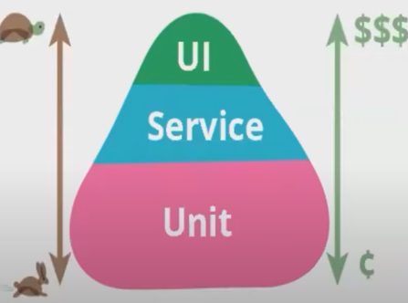
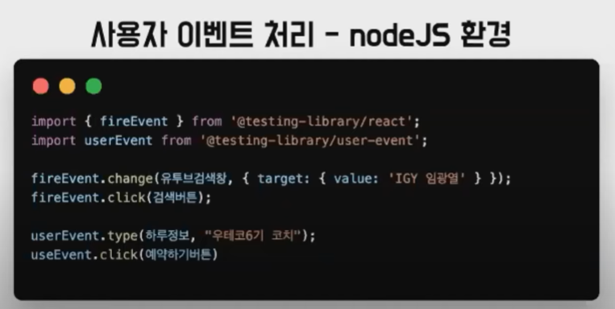
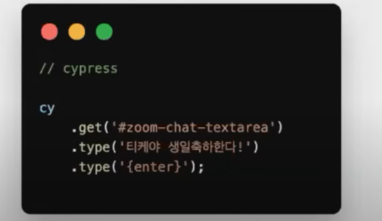
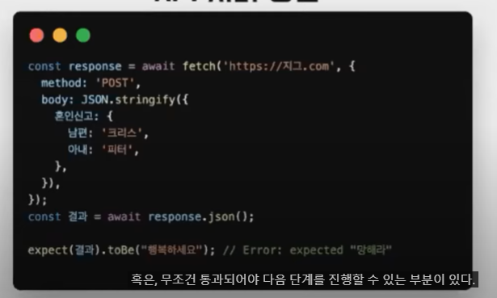
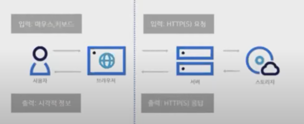
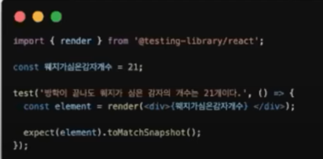
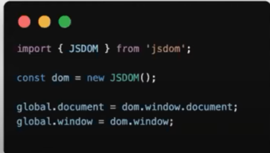

10분 테코톡 도비님의 ''프론트엔드에서의 테스트 종류'' 를 시청하고 작성했습니다.

 

# 프론트엔드에서의 테스트 종류.

 

## 테스트란?

* 프로그램을 실행하여 오류와 결함을 검출하고 애플리케이션이 요구사항에 맞게 동작하는지 검증하는 절차.

 

## 테스트의 목적

* 발생 가능한 **결함을 예방**하고 어플리케이션이 **요구사항을 충족**하는지 검증
* 개발 과정에서 생기는 **변경사항들로 인해 새로운 결함**이 유입되지 않았는지 확인 가능.

 

> 내 코드에 대한 자신감도 얻을 수 있음.
>
> 내 코드에 자신감이 없다면
>
> * 기존 버그 수정
> * 새로운 기능 추가
> * 리팩토링
>
> 에 소극적이 되고 기술부채가 쌓이게 된다.
>
> * 기술부채란 기술적으로 해결되어야 할 문제들을 뒤로 미루고 비즈니스 문제를 해결하는 시점을 앞당기는 것.
>
> 기술 부채가 증가하면 파산하고 코드, 시간, 돈, 의욕 다 날리게 된다.

 

 

 

## 프론트엔드 개발에서 자주 언급되는 테스트

* Kent.C.Dodds : 자바스크립트 테스트 도구, testing-library 개발자.
* 테스팅 트로피?

 

1. 정적 테스트 : 코드를 실행시키지 않고 테스트를 하는 것

   * 구문오류, 나쁜 코드 스타일 등을 검증.
   * ex.) ESlint(사용하지 않는 변수 찾기), Typescript(변수 타입 검사)
   *  

2. Unit 테스트 : 작은 단위를 떼어 내어 분리된 환경에서 테스트.

   * 복잡한 알고리즘이 제대로 동작하는지 확인
   * Mocking 필요
   * 작성비용낮음
   * 실행속도 빠름
   * ex.) Jest

    

3. Intergration(통합) 테스트 : 어플리케이션의 여러 부분들이 통합되어 제대로 상호작용 되는지 테스트

   * 주로 단위 테스트보다 큰 범위(페이지)의 테스트.
   * 앱 모든 기능이 제대로 동작한다는 확신을 가질 수 있다.
   * ex.) Jest, RTL, Enzyme

 4. E2E(end to end) 테스트 : 실제 사용자가 사용하는 것과 같은 조건에서 전체 시스템을 테스트

* APi서버, DB 등의 외부 서비스들을 모두 사용하여 통합된 시스템을 테스트

* 비용이 많이들고 속도도 느림, 작성도 어려움, 테스트시나리오도 다양, 오류도 다양. 100% 신뢰성 가질수 없음
* 기능 테스트, mocking하는 UI테스트 포함.
* ex.) Cypress, Selenium

 

리팩터링의 저자 마틴 파울러의 테스팅 피라미드.

* UI가 느리며 코드작성에 돈이 많이들고
* Unit테스트로 내려갈수록 빠르고 돈도 적게든다.
* 통합 테스트는 가장 균형이 맞다.

 

> Unit테스트를 많이 가져가면 좋다. 둘의 중간 역할이 Service test인데 얘가 Integration test에 매핑된다.
>
> 테스트 작성은 너무 과하지 안게(테스트 커버리지 70프로 이상이면 테스트에 시간을 과하게 씀), 통합 테스트 위주로.
>
> 다른 테스트도 다 중요하나 결국 3가지 전부 통과해야 함은 맞기에 밸런스가 적절한 통합을 강조하는 것 뿐.
>
> (리소스가 제한적이기 때문.)

 

 

 

## 프론트엔드 테스팅 대상.

* API 서버 통신
* 사용자 이벤트 처리
* 시각적 요소.

 

 

### 사용자 이벤트 처리

* 프론트엔드 개발자는 사용자의 마우스, 키보드 등의 입력 이벤트를 적절한 이벤트 핸들러로 처리하는 것을 담당.
* 이를 테스트 하기 위해서는 JS API, E2E 테스트를 통해서 실제 브라우저 상에서 이벤트를 발생시켜서 테스트를 해야합니다.

* node환경인 경우에 testing-librar에서 제공하는 메서드들을 fireEvent와 useEvent를 통해서 테스트 할 수 있다.

* useEvent는 내부적으로 fireEvent를 활용. 다른 용도의 기능이 추가된 형태. fireEvent가 더 low한 형태.

* E2E 테스트 도구인 cypress 사용가능.
* 실제 브라우저에서 보이는 요소를 컨트롤해 사용자요소를 직접 테스트함.

 

 

### API 서버 통신

* 프론트엔드는 브라우저 API또는 라이브러리를 사용하여 API와 통신하고 어플 상태를 동기화하는 작업도 수행해야 한다.

* API는 백엔드 쪽인데 테스트 하기 위해서는 실제 API서버를 쓰거나 테스트 API서버를 구축하거나 

* API Clinent를 mocking하는 방법이 있다. 단위 또는 통합 테스트 환경에서 주로 처리되며 API Client를 모킹하면 내가 원하는 응답을 받게 할 수 있기 때문에 다양한 상황을 test할 수 있다. 

* React 팀에서 권장하는 Jest, testing-library를 사용하면 모듈을 간단한 방법으로 모킹 할 수 있다.

  

ex.) 내가 테스트 하려는 코드에 fetch가 제대로 호출되는지? 

혹은 무조건 통과 되어야 다음 단계를 진행 할 수 있는 부분이 있다면 해당 코드가 서버상태에 의존하게 되는데

이때 fetch같은 API함수를 mocking해준다. 또는 mock서버를 따로 만들어서 구현해도 된다.

위의 코드는 Jest를 이용 window의 fetch method의 json을 모킹한 것이다.(덮어씌운 것.)

 

 

### 시각적 요소.

* 테스트는 기본적으로 입력값, 출력값을 검증.

* 백엔드의 경우, HTTP요청을 보내면 HTTP응답으로 검증이 가능한데
* 프론트엔드의 경우 입력값은 `사용자의 액션`이고 출력값은 `시각적 정보`(사용자 액션에 따른 화면의 변화)이다.

* 시각적 요소를 코드로 검증?

  * 스냅샷 테스트

    * HTML 구조가 의도한 대로 나타나는지를 테스트(Jest - toMatchSnapshot()메소드)

      

    * 현재 HTML구조를 저장 할 수 있음. 실제 작동하면 작성됐다는 문구와 합께 스냅샷 파일이 만들어짐.

    * 해당 테스팅을 반영하면 기존 저장된 스냅샷과 HTML구조가 동일하지 않으므로 테스트가 실패하게된다.

  * 시각적 회귀 테스트(StoryBook 도구)

    * HTML에 CSS를 더해서 컴포넌트가 실제로 브라우저에서 렌더링되는 모습이 내가 의도한 대로 나타나는지를 테스트.

 

 

## 테스팅 환경

* 브라우저 환경
* Node.js 환경

 

### 브라우저 환경

* 네트워크 IO, 렌더링엔진 활용 가능
* 모든 Web API에 접근 가능. 서로 다른 브라우저에서 테스트 가능
* 테스트 코드를 다양한 운영체제, 브라우저 사용가능 => `호환성 체크가능`(브라우저, 기기 호환성)
* Node.js에 비해 무거워서 초기 구동 속도가 늦다.
* 브라우저를 사용하기 위해 별도로 설치가 필요하다 => Headless 브라우저로 사용하는 것을 권장.
* ex.) Karma, Selenium, Cypress

 

### Node.js

* 설치 및 실행이 간단하고 속도가 빠르다.
* 모듈 단위로 테스트 가능하다.
* DOM, BOM API가 없다 => 그래서 jsdom(dom을 가상으로 구현하는 library)을 사용하나 브라우저 동작을 100% 구현하진 못한다.
* ex.) Jest, Mocha

 

json에 있는 dom을 node의 global에 mocking(덮어씌워 사용한다.)

 

 

### 그럼 언제 뭘써?

1. 크로스 브라우징 테스트가 '반드시' 필요한 경우 브라우저 환경을 사용한다.

   (최신 브라우저들이 표준에 맞게 구현이 잘 되고 있고, 브라우저간의 차이가 많이 없어졌고 문법 호환성은 Babel이 잡아주고 DOM조작도 React나 Vue가 대신 해주기 때문에 반드시 필요한 경우에만 브라우저 환경을 사용 + QA분들이 테스트 부담감을 덜어주심)

2. 브라우저의 실제동작(렌더링, 네트워크IO, 네비게이션 등)에 대한 테스트가 필요한 경우 브라우저 환경을 사용한다.

3. 그 외의 경우 Node.js 환경을 사용한다.

 

 

## 추가적으로 고려해야 할 사항

* 어플리케이션의 종류
  * 비주얼 요소? -> 차트 등.
  * 모든 브라우저에서 테스트 해야하는가? -> 에디터 등
* 팀 구성
  * 별도의 QA팀이 있는가?
  * 서버-클라이언트르 모두 통제할 수 있는가?
* 어플리케이션의 규모 및 복잡성
  * 간단한 라이브러리
  * 복잡한 라이브러리
  * 복잡한 웹 서비스

 

> 본인과 팀의 기준을 만들어 적용해 나가야함.

